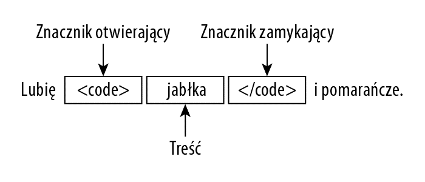

# 1. Wprowadzenie do HTML-u.

HTML jest językiem znaczników. Znaczniki te przyjmują formę **elementów**, które odnoszą się do **treści** — na ogół
tekstu.

## 1.1. Korzystanie z elementów

W skład elementu HTML wchodzą:

1. **Znaczniki**, zwane również **tagami**:

* znacznik otwierający — tutaj `<code>`
* znacznik zamykający — tutaj `</code>`

2. Treść elementu - tutaj `jabłka`.



Elementy służą do podawania przeglądarce informacji o właściwej treści. Każdy element HTML ma swoje znaczenie; np.
element `code` opisuje fragment kodu komputerowego.

> **Uwaga**. Wielkość liter nie jest istotna przy zapisie nazw elementów. Jednakże częściej wybieranym
> stylem jest zapis wyłącznie małymi literami.

Poniżej prosty przykład tekstu oznaczonego elementem HTML.

```html
Prezentacja kodu na stronie internetowej <code>alert('Hello world')</code>

Lubię <code>jabłka</code> i pomarańcze.
```


Przeglądarka wyświetla inną czcionką tekst zawarty między znacznikami `code`. Kolor czcionki dodałem do styli, aby
lepiej uwypuklić zmianę. Nie wyświetla tagów elementu, za to interpretuje kod HTML i przedstawia treść, uwzględniając
znaczenie tagu.

W HTML występują różne rodzaje elementów, które pełnią różne funkcje w dokumencie HTML — element `code` jest
przykładem **elementu semantycznego**. Elementy semantyczne pozwalają nam na określenie znaczenia treści i relacji
pomiędzy różnymi jej fragmentami.

> **Rozdzielanie prezentacji od treści**
>
> Niektóre elementy HTML wpływają na prezentację treści, jednakże należy je stosować do określania struktury i
> znaczenia treści, a arkuszy CSS do definiowania prezentacji.
>
> Elementy wpływające na prezentację to zazwyczaj te, które pojawiły się we wczesnych wersjach HTML, kiedy
> nie przestrzegano rozdziału prezentacji od treści. Przeglądarki nadają takim elementom domyślne style prezentacji,
> np. font o stałej szerokości znaków w przypadku elementu `code `. Występowanie owych domyślnych stylów można
> zniwelować przy użyciu kodu CSS.


Tabela. Niektóre elementy HTML

| Elementy | Opis | 
| --- | --- |
| `a` | Odnośnik |
| `body` | Treść dokumentu HTML |
| `button`| Przycisk do zatwierdzania formularzy|
| `code`| Fragment kodu komputerowego |
| `doctype`| Początek dokumentu HTML |
| `head`| Nagłówek dokumentu |
| `hr`| Zmiana tematyczna |
| `html`| Sekcja HTML dokumentu |
| `input`| Dane wejściowe podawane przez użytkownika |
| `label`| Etykieta dla innego elementu |
| `p` | Akapit |
| `style`| Określa styl CSS |
| `table`| Dane tabelaryczne |
| `td`| Komórka tabeli |
| `textarea`| Wielowierszowe pole tekstowe| |
| `th`| Komórka nagłówka tabeli |
| `title` | Tytuł dokumentu |
| `tr` | Rząd (wiersz) tabeli |

### Puste elementy

Między znacznikiem otwierającym i zamykającym nie trzeba umieszczać treści. W takich sytuacjach powstaje pusty element:

```html
Prezentacja kodu na stronie internetowej <code></code>.
```

Nie wszystkie puste elementy mają sens, jak np. `code`, jednakże jest to poprawny kod HTML.

### Samozamykające znaczniki

Puste elementy można zapisywać przy użyciu pojedynczego znacznika:

```html
Prezentacja kodu na stronie internetowej <code/>.
```

### Elementy void

Elementy `void` to elementy niezawierające żadnej treści. Zapisujemy je za pomocą pojedynczych tagów.

Z elementów void możesz korzystać na dwa sposoby:

```html
Lubię jabłka i pomarańcze.
<hr>
Było dziś ciepło i słonecznie.
```

```html
Lubię jabłka i pomarańcze.
<hr/>
Było dziś ciepło i słonecznie.
```

Element `hr` jest kolejnym przykładem elementu o znaczeniu prezentacyjnym — w jego miejscu przeglądarka wyświetla
poziomą linię.


> **Używanie opcjonalnych znaczników otwierających i zamykających (lub nie)**
>
> Wiele elementów HTML5 objętych jest specjalnymi zasadami, zgodnie z którymi można pominąć któryś ze znaczników.
> Dobrą praktyką jest stosowanie otwierających i zamykających znaczników.

## 1.2. Atrybuty elementów

Elementy możesz konfigurować przy użyciu **atrybutów**.

```html
Lubię <a href="Jabłka.html">jabłka</a> i pomarańcze.
```

Atrybuty można dodawać jedynie do znaczników otwierających i pojedynczych, a nigdy do znaczników zamykających. Atrybut
ma swoją nazwę i wartość.


Istnieją atrybuty globalne, które można przypisać każdemu elementowi HTML. Poszczególne elementy mają też własne
atrybuty. Atrybut `href` jest atrybutem lokalnym elementu `a` i służy do wskazania adresu URL, do którego prowadzi
odnośnik.

> **Uwaga**
>
> Wartość atrybutu ujmujemy w cudzysłów albo w apostrofy.

### Nadawanie elementom wielu atrybutów

Elementowi możesz nadać więcej niż jeden atrybut, oddzielając je od siebie jedną lub większą liczbą spacji:

```html
Lubię <a class="link" href="Jabłka.html" id="firstlink">jabłka</a> i pomarańcze.


```

Kolejność atrybutów nie jest istotna i możesz dowolnie zestawiać atrybuty globalne z właściwymi dla danego elementu.

### Atrybuty boolowskie.

Atrybutom boolowskim nie trzeba podawać wartości.

```html
Podaj swoje imię: <input disabled>
```

Sama ich obecność, a nie wartość konfiguruje element. Nie podałem disabled="true", lecz samo słowo disabled. Ten sam
efekt można uzyskać, podając pusty ciąg ("") lub nadając atrybutowi wartość będącą jego własną nazwą.

```html
Podaj swoje imię: <input disabled="">
Podaj swoje imię: <input disabled="disabled">
```

### Atrybuty autorskie

Masz możliwość definiowania własnych atrybutów poprzedzonych przedrostkiem `data-`, aby zapobiec interferencjom z
nazwami atrybutów, które mogą się pojawić w przyszłych wersjach HTML.

```html
Podaj swoje imię: <input disabled="true" data-creator="adam" data-purpose="collection">
```

Atrybuty autorskie przydają się w pracy z CSS i JavaScript.

## 1.3. Tworzenie dokumentu HTML

Elementów i atrybutów używa się do oznaczania treści dokumentu HTML. Aby stworzyć dokument HTML, należy utworzyć pliku
tekstowego z rozszerzeniem .html. Plik można otworzyć w przeglądarce bezpośrednio z dysku lub za pośrednictwem serwera.

> **Przeglądarki i klienty użytkownika**
>
> Klient użytkownika to zbiorcza nazwa programów i komponentów służących do przetwarzania kodu HTML. Istnieją też inne
> rodzaje oprogramowania niż przeglądarka.
>
> Zwiększony nacisk na oddzielanie treści od prezentacji w HTML5 jest ważny, ponieważ uznaje się, że nie cała
> treść kodu HTML jest przedstawiana użytkownikom. Warto mieć na uwadze to, iż kod HTML5 może być także używany
> przez innego rodzaju programy.

Dokument HTML ma określoną strukturę — konieczne jest umieszczenie w nim kilku kluczowych elementów.

### Nadrzędna struktura

Za ogólną strukturę dokumentu HTML odpowiadają dwa elementy: DOCTYPE i html:

```html
<!doctype html>
<html>
<!-- tutaj wstaw elementy -->
</html>
```

Element `DOCTYPE` informuje przeglądarkę, że ma do czynienia z dokumentem HTML. Wskazuje to boolowski atrybut HTML.

Po elemencie `DOCTYPE` zamieszcza się otwierający znacznik elementu `html`. Treść elementu, aż do znacznika
zamykającego `html`, powinna być traktowana jako kod `HTML`.

### Metadane

Metadane zawiera się w elemencie `head`, przekazują one przeglądarce informacje o dokumencie.

```html
<!DOCTYPE HTML>
<html>
<head>
  <!-- tutaj wstaw metadane -->
  <title>Przykład</title>
</head>
</html>
```

Wszystkie dokumenty HTML powinny zawierać element `title`, choć przeglądarki na ogół nie zwracają uwagi na braki w tym
zakresie. Większość przeglądarek wyświetla zawartość elementu `title` w pasku menu swojego okna lub u góry zakładki.

Element `head` służy również do określania powiązań z zewnętrznymi zasobami (w rodzaju arkuszy CSS), definiowania stylów
CSS typu inline (tj. zawartych w pliku HTML) oraz definiowania i wczytywania skryptów.

### Treść

Trzecia i ostatnia część dokumentu to treść, którą umieszcza się w elemencie body.

```html
<!DOCTYPE HTML>
<html lang="pl">
<head>
  <!-- tutaj wstaw metadane -->
  <title>Przykład</title>
</head>

<body>
<!-- tutaj wstaw treść i elementy -->
Lubię <code>jabłka</code> i pomarańcze.
</body>
</html>
```

Element body wskazuje przeglądarce, która część dokumentu ma być pokazana użytkownikowi

### Rodzice, dzieci, potomkowie i bracia

Mówimy, że element zawarty jest w innym, jeśli znajduje się on między znacznikiem otwierającym a znacznikiem zamykającym
tego innego elementu. Element, który zawiera inny element, jest jego **rodzicem**. Z kolei element zawarty w innym jest
jego **dzieckiem**. Element może mieć wiele dzieci, ale tylko jednego rodzica.

Elementy, które są zawarte w innych, które następnie są zawarte w elementach, które znajdują się nad nimi, tworzą
hierarchię elementów potomnych. Dzieci są bezpośrednimi potomkami. Elementy o wspólnym rodzicu nazywamy **braćmi**.

### Typy elementów

Mamy trzy kategorie elementów:

1. Metadane (ang. *metadata*), które informują przeglądarkę, jak ma przetworzyć dokument.
2. Strukturalne (ang. *flow*)
3. Treściowe (ang. *phrasing*)

Kategoria elementów strukturalnych jest nadzbiorem elementów treściowych. Wszystkie elementy treściowe są więc także
elementami strukturalnymi, lecz nie wszystkie elementy strukturalne są elementami treściowymi.

Nie wszystkie elementy należą do którejś z kategorii elementów jak np. element `li`, którego stosowanie ogranicza się
tylko do jednego z trzech rodziców: `ol` , `ul`  lub `menu`.

## 1.4. Encje HTML

Encja jest kodem zastępującym w przeglądarce dany znak. Często używane to:

Znak | Nazwa encji | Numer encji
---|----|---|
< |  &lt\; | &#60\; |
\> | &gt\; | &#62\;|
&amp; | &amp\; | &#30\; |
&euro; | &euro\; | &#8364\; |
&pound; | &pound\; | &#163\; |
&sect; | &sect\; | &#1167\;
&copy; | &copy\; | &#169\;
&reg; | &reg\; | &#174\;
&trade; | &trade\; | &#8482\;

## 1.5. Globalne atrybuty HTML5

Każdy element ma właściwe sobie atrybuty, zwane **atrybutami lokalnymi**, które dają możliwość kontrolowania jakiegoś
wyjątkowego aspektu funkcjonowania elementu.

Istnieją także **atrybuty globalne**, określające zachowanie wspólne dla *wszystkich* elementów HTML; mogą być używane
na wszystkich elementach, chociaż mogą nie mieć wpływu na niektóre elementy.

Oprócz podstawowych atrybutów globalnych HTML istnieją również następujące atrybuty globalne:

* Wiele atrybutów `aria-*`, używanych do poprawy dostępności.
* Atrybuty obsługi zdarzeń: m.in. `onchange`, `onclick`, `onkeydown`, `onload`, `onmousedown`, `onsubmit` itp.

### Atrybut accesskey

Atrybut `accesskey` pozwala na określenie jednego lub więcej skrótów klawiszowych służących do wybierania elementu na
stronie

### Atrybut class

Atrybut `class` służy do klasyfikowania, czy też katalogowania elementów. Robi się to zwykle w celu umożliwienia
wyszukiwania zawartych w dokumencie elementów przynależących do danej klasy lub zastosowania stylu CSS.

Każdemu elementowi możesz przypisać wiele klas, oddzielając ich nazwy spacją. Nazwy utworzonych klas mogą być dowolne,
ale warto dobrać znaczące nazwy, zwłaszcza jeśli w Twoim dokumencie ma ich być wiele. Atrybut class sam w sobie niczego
nie robi.

### Atrybut `contenteditable`

Atrybut `contenteditable` pozwala użytkownikowi na zmianę treści strony. Przypisanie atrybutowi wartości `true`
umożliwia użytkownikowi edycję zawartości elementu, a przypisanie mu wartości `false` z kolei dezaktywuje tę funkcję.
Jeżeli wartość nie jest podana, to element dziedziczy ustawienie po rodzicu.

### Atrybut contextmenu

Atrybut contextmenu jest przestarzały i zostanie usunięty ze wszystkich przeglądarek.

### Atrybut dir

Atrybut `dir` określa kierunek tekstu elementu. Obsługuje on dwie wartości: `ltr` (tekst od lewej do prawej)
i `rtl` (tekst od prawej do lewej).

### Atrybut draggable

Atrybut draggable jest częścią funkcji przeciągania i upuszczania w HTML5; służy do wskazywania, czy dany element można
przeciągnąć. Przeciąganie i upuszczanie omówię szerzej w rozdziale 37.

### Atrybut dropzone

Atrybut dropzone jest częścią funkcji przeciągania i upuszczania w HTML5; jest uzupełnieniem opisanego powyżej atrybutu
draggable. Obydwa atrybuty omówię w rozdziale 37

### Atrybut hidden

Atrybut `hidden` jest atrybutem logicznym wskazującym, że element nie jest jeszcze lub nie jest już istotny. Na przykład
może służyć do ukrywania elementów strony, których nie można używać do czasu zakończenia procesu logowania. Przeglądarki
nie będą renderować elementów z zestawem ukrytych atrybutów.

Na przykład niewłaściwe byłoby użycie atrybutu `href` do linkowania do sekcji oznaczonej atrybutem `hidden`. Jeśli treść
nie ma zastosowania lub nie jest istotna, nie ma powodu, aby do niej linkować.

## 1.6. przydatne narzędzia HTML

## Podsumowanie

# 3. Zaawansowane funkcje

## 3.3. Multimedia

### Format ścieżek tekstowych wideo w sieci Web (WebVTT)

`Web Video Text Tracks Format (WebVTT)` to format wyświetlania ścieżek tekstowych w czasie (takich jak napisy lub
podpisy) przy użyciu elementu `<track>`. Głównym celem plików `WebVTT` jest dodawanie nakładek tekstowych do `<video>`.
`WebVTT` to format tekstowy, który musi być zakodowany przy użyciu `UTF-8`. Tam, gdzie możesz używać spacji, możesz
również użyć tabulatorów. Dostępny jest również mały interfejs `API` do reprezentowania i zarządzania tymi ścieżkami
oraz danymi potrzebnymi do odtwarzania tekstu we właściwym czasie.

### Element video

Element video służy do zamieszczania materiałów wideo na stronie internetowej.

1. Atrybuty lokalne:

* autoplay
* preload — ma wartości none, metadata, auto
* controls
* loop
* poster — wskazuje obraz zastępczy
* height
* width
* muted
* src

2. Zawartość:

* Element track — zawiera plik .vtt ze ścieżkami tekstowymi do filmu
* Element source - zawiera alternatywne formaty video

### Element track — element osadzonej ścieżki tekstowej

Element HTML `<track>` jest używany jako element potomny elementów media, `<audio>` i `<video>`. Pozwala określić
czasowe ścieżki tekstowe (lub dane oparte na czasie), na przykład w celu automatycznej obsługi napisów. Ścieżki są
sformatowane w formacie `WebVTT (pliki .vtt)` — Web Video Text Tracks.

1. Dozwolenie rodzice:

* video
* audio

2. Atrybuty lokalne:

* kind
* src
* srclang
* label
* default

3. Przykład:

```html

<video src="friday.mp4" controls width="350">
  <track default
         kind="captions"
         srclang="en"
         src="friday.vtt">
  Sorry, your browser doesn't support embedded videos.
</video>
```

### Element source

Element `<source>` służy do określania zróżnicowanych formatów.

1. Dozwoleni rodzice:

* video
* audio

2. Atrybuty lokalne:

* src
* type
* media

3. Przykład:

```html

<video controls width="360" height="240">
  <source src="timeshare.webm">
  <source src="timeshare.ogv">
  <source src="timeshare.mp4">
  Nie można wyświetlić filmu
</video>
```


